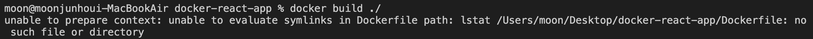
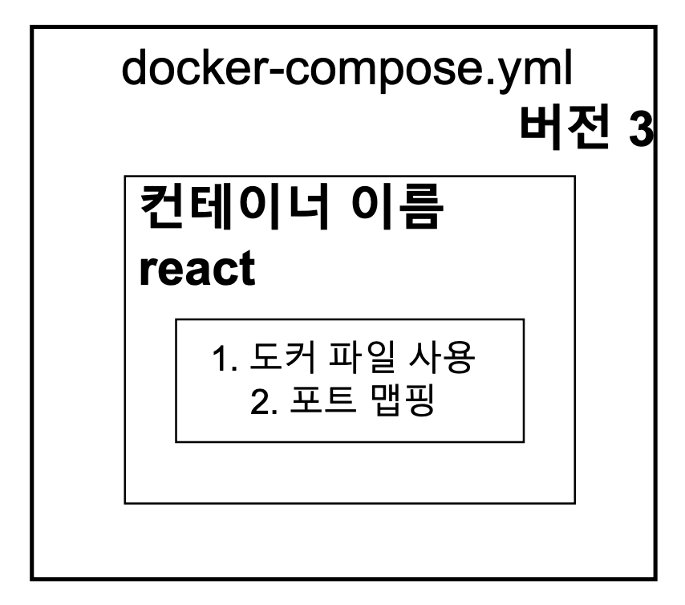

> 리액트를 활용한 도커 단일 컨테이너 실습 내용을 정리하였습니다.

# 1. 도커 파일 작성

지금까지는 1개의 도커 파일만 생성하였다. 그러나 **실제로는 개발을 위한 도커 파일과 배포를 위한 도커 파일을 분리해서 작성**한다.

보편적으로 다음과 같은 네이밍을 통해 개발용과 배포용 도커 파일을 구분 짓는다.

- 개발 : `Dockerfile.dev`
- 배포 : `Dockerfile`

`Dockerfile.dev` 를 만들어 다음과 같이 작성 후, `docker build ./` 명령어를 통해 이미지를 생성해보자.

```docker
FROM node:alpine
WORKDIR /usr/src/app
COPY package.json ./
RUN npm install
COPY ./ ./
CMD ["npm","run","start"]
```

### ❌ 에러: Dockerfile을 찾을 수 없다.

이미지를 빌드할 때 디렉토리만 정해주면 **Dockerfile을 자동으로 찾아서 빌드**를 해준다. 그러나 개발용을 위한 `Dockefile.dev` 를 만들었기 때문에 찾지 못하는 문제가 발생한다.

<center></center>

### ✅ 해결: build 시 어떠한 파일을 참조할지 명시 (-f 옵션)

다음 명령어를 통해 빌드할 때 사용할 도커 파일을 명시해준다.
`docker build -f Dockerfile.dev ./`

### 로컬 node_modules는 삭제해도 된다 !

도커 환경에서 로컬에 있는 node_modules 필요 없으며 이유는 다음과 같다.

- 이미 `RUN npm install` 를 통해 컨테이너에는 `node_modules` 가 존재한다.
- `COPY ./ ./` 시 로컬의 `node_modules`를 컨테이너에 복사해서 넣는 것은 불필요하다.
- 더군다나 `node_modules` 의 용량은 꽤 크기 때문에 비효율적이다.

# 2. Volume 적용

소스를 변경했을 때 다시 이미지를 빌드하지 않아도 **변경된 소스가 반영되게 끔 하기 위하여 Volume을 적용**한다.

명령어는 다음과 같다.   
`docker run -p 3000:3000 -it -v /usr/src/app/node_modules -v $(pwd):/usr/src/app zoolake/docker-react-app`

# 3. Docker Compose 적용

Volume을 사용하기 위해서는 너무 긴 명령어를 입력하여야 한다.
이러한 불편함을 해소하기 위하여 Docker Compose를 적용하여 문제를 해결한다.

### docker-compose.yml 파일 생성

<center></center>

```yaml
version: "3"
services:
  react:
    build:
      context: .
      dockerfile: Dockerfile.dev
    ports:
      - "3000:3000"
    volumes:
      - /usr/src/app/node_modules
      - ./:/usr/src/app
    stdin_open: true
```

- version : 도커 컴포즈의 버전
- services : 실행하려는 컨테이너들을 정의
  - react : 컨테이너 이름
    - build : 현 디렉토리에 있는 Dockerfile 사용
      - context : 도커 이미지를 구성하기 위한 파일과 폴더들이 있는 위치
      - dockerfile : 도커 파일 명시
    - ports : 포트 맵핑 (로컬 포트 : 컨테이너 포트)
    - volumes : 로컬에 있는 파일들 맵핑
    - stdin_open : 리액트 앱을 종료할 때 필요 (버그 수정을 위함)

# 4. 테스트

로컬에서 리액트 앱을 테스트 하기 위해 `npm run test` 명령어를 사용한다. 도커에서는 다음 명령어를 통해 테스트를 진행할 수 있다.
`docker run -it <이미지명> npm run test`

만약, 테스트 소스도 변경시 자동으로 반영되게 하고 싶다면 **Test를 위한 컨테이너**를 `docker-compose.yml` 파일에 추가한다.

```yaml
version: "3"
services:
  react:
    build:
      context: .
      dockerfile: Dockerfile.dev
    ports:
      - "3000:3000"
    volumes:
      - /usr/src/app/node_modules
      - ./:/usr/src/app
    stdin_open: true
  tests:
    build:
      context: .
      dockerfile: Dockerfile.dev
    volumes:
      - /usr/src/app/node_modules
      - ./:/usr/src/app
    command: ["npm", "run", "test"]
```

# 5. Nginx를 포함하는 운영환경 이미지

**운영환경을 위한 Dockerfile은 2가지 단계로 구성되어 있다.**

1. Build 파일을 만든다. → Builder Stage
   - Builder Stage : 빌드 파일들을 생성하며, 생성된 파일 및 폴더들은 `{WORKDIR}/build` 로 들어간다.
2. Nginx 실행 및 생성된 Build 파일을 제공해준다. → Run Stage

```docker
FROM node:alpine as builder
WORKDIR /usr/src/app
COPY package.json ./
RUN npm install
COPY ./ ./
RUN npm run build

FROM nginx
COPY --from=builder /usr/src/app/build /usr/share/nginx/html
```

위 Dockerfile을 뜯어보면 다음과 같다.

- `FROM node:alpine as builder`
  - 현재 FROM부터 다음 FROM 전까지는 builder stage 임을 명시
- `FROM nginx`
  - Nginx를 위한 베이스 이미지
- `COPY --from=builder /usr/src/app/build /usr/share/nginx/html`
  - `--from=builder`
    - 다른 Stage에 있는 파일을 복사할 때, 다른 Stage 이름을 명시한다. 여기서는 Builder Stage에 있는 파일을 복사한다는 뜻
  - `/usr/src/app/build /usr/share/nginx/html`
    - Builder Stage에서 생성된 파일은 `/usr/src/app/build` 에 들어가게 된다.
    - `/usr/src/app/build` 에 저장된 파일들을 `/usr/share/nginx/html` 로 복사를 하여,
      Nginx가 http 요청이 올 때 마다 해당하는 파일들을 보여줄 수 있다.
    - `/usr/share/nginx/html` 경로로 Build 파일들을 복사 시키는 이유는 Nginx가 해당 경로에서 자동적으로 정적 파일들을 찾기 때문이다.

이후 `docker build ./` 를 통해 Dockerfile로 이미지를 생성하고, 생성된 이미지를 기반으로
`docker run -p 8080:80 <이미지 이름>` 을 통해 앱을 실행한다.

- 참고로 Nginx 의 기본 포트가 80이다.
