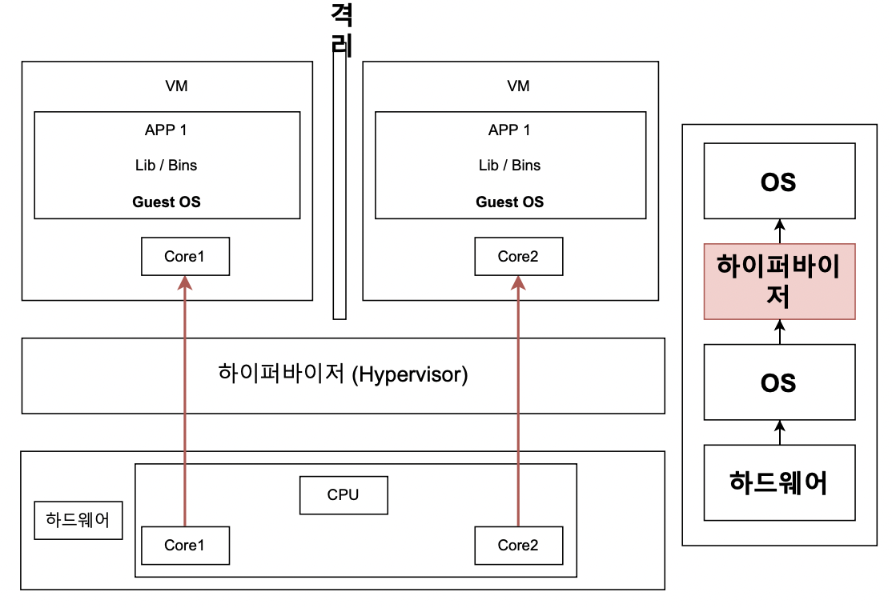
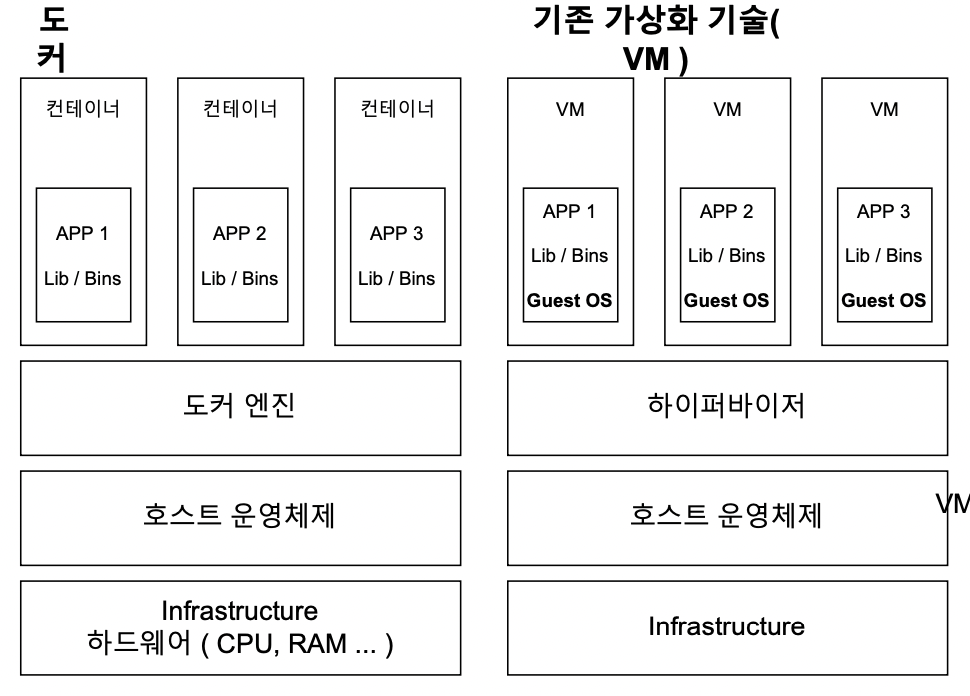
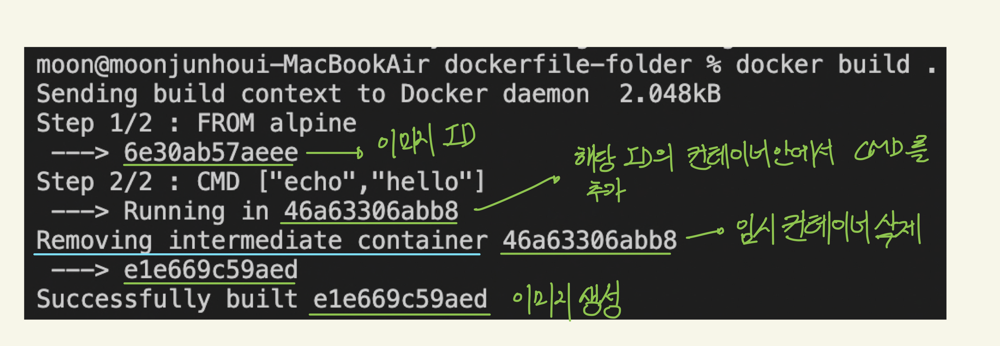
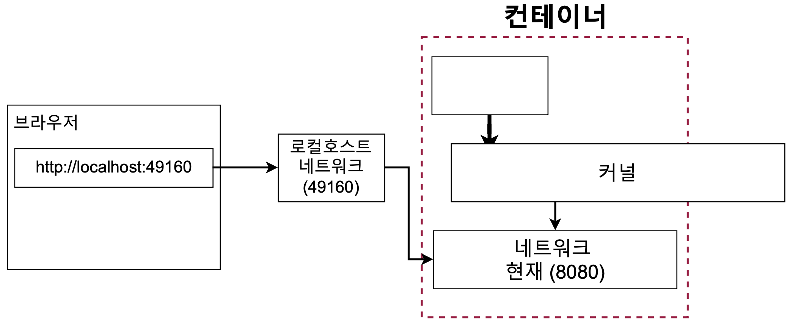

> _인프런 ‘따라하며 배우는 도커와 CI 환경’ 를 보고 정리한 내용입니다._

# 목차

- [도커란?](#도커란?)
- [도커를 쓰는 이유?](#도커를-쓰는-이유?)
- [도커의 사용 흐름](#도커의-사용-흐름)
- [도커와 기존 가상화 기술과의 차이](#도커와-기존-가상화-기술과의-차이)
- [이미지 내부 파일 시스템 구조 보기](#이미지-내부-파일-시스템-구조-보기)
- [현재 실행중인 컨테이너 나열](#현재-실행중인-컨테이너-나열)
- [도커의 생명 주기](#도커의-생명-주기)
- [실행중인 컨테이너에 명령어 전달](#실행중인-컨테이너에-명령어-전달)
- [레디스 실행해보기](#레디스-실행해보기)
- [실행중인 컨테이너에서 터미널 열기](#실행중인-컨테이너에서-터미널-열기)
- [도커 이미지](#도커-이미지)
- [도커 파일로 도커 이미지 만들기](#도커-파일로-도커-이미지-만들기)
- [도커를 이용한 Node.js 앱 만들기](#도커를-이용한-Node.js-앱-만들기)

# 도커란?

- **컨테이너**를 사용하여 응용프로그램을 더 쉽게 만들고 배포하고 실행할 수 있도록 설계된 도구이며
  컨테이너 기반의 오픈소스 가상화 플랫폼이며 생태계이다.
- **다양한 프로그램, 실행환경을 컨테이너로 추상화**하고 동일한 인터페이스를 제공하여 프로그램의 배포 및 관리를 단순하게 해준다.

## 컨테이너

- 코드와 모든 종속성을 패키지화하여 응용 프로그램이 한 컴퓨팅 환경에서 다른 컴퓨팅 환경으로 안정적이고 빠르게 실행되도록 하는 소프트웨어 표준 단위이다.

## 컨테이너 이미지

<aside>
📍 이미지를 이용해서 컨테이너를 생성하며, 컨테이너를 이용해서 프로그램을 실행한다.

</aside>

- 코드, 런타임, 시스템 도구, 시스템 라이브러리 및 설정과 같은 응용 프로그램을 실행하는 데 필요한 모든 것을 포함한 가볍고 독립적이며 실행 가능한 소트프웨어 패키지

### 이미지를 통해 컨테이너 만드는 과정

1. Docker 클라이언트에 `docker run <이미지>` 입력
2. 이미지에 있는 파일 스냅샷을 컨테이너 하드 디스크에 옮김
3. 이미지에 있는 명령어 (컨테이너가 실행될 때 사용될 명령어)를 이용해서 어플리케이션을 실행

# 도커를 쓰는 이유?

- 서버, 패키지 버전, 운영체제 등에 따라서 프로그램 설치를 위해 고려해야 할 부분이 많다.
- 프로그램을 다운 받는 과정을 간단하게 만들기 위해서 도커를 사용한다.

# 도커의 사용 흐름

**도커의 실행 흐름은 다음과 같다.**

1. 도커 CLI에 명령어 입력
2. 도커 서버 (도커 Daemon)이 명령어를 받고 그것에 따라 이미지를 생성하든 컨테이너를 실행하든 작업을 수행한다.

`**dockr run hello-world` 를 입력하면 다음과 같이 실행된다.\*\*

1. `dockr run hello-world` 를 입력한다.
2. 도커 서버에서 위 명령어가 전해진다.
3. hello-world 라는 이미지가 로컬 이미지 캐시에 저장되어 있는지 확인한다.
   1. 만약 이미지가 없다면 도커 허브에서 이미지를 가져온다.

# 도커와 기존 가상화 기술과의 차이

## 배경

### 가상화 기술 나오기 전

- 하나의 서버에 하나의 운영체제, 하나의 프로그램만을 운영
- 안정적이나 매우 비효율적

### 하이퍼 바이저 기반의 가상화 출현

- **하이퍼 바이저**는
  - 호스트 시스템에서 다수의 게스트 OS를 구동할 수 있게 하는 소프트웨어
  - 하드웨어를 가상화하면서 하드웨어와 각각의 VM을 모니터링 하는 중간 관리자
- 논리적으로 공간을 분할하여 VM이라는 독립적인 가상 환경의 서버 이용 가능

## 하이퍼 바이저 기반의 VM 구조

- 각 VM마다 독립된 가상 하드웨어 자원을 할당받는다.
- 논리적으로 분리되어 있기 때문에 하나의 VM에서 오류가 발생해도 다른 VM으로 퍼지지 않는다.

<center></center>

## 컨테이너 가상화 기술의 등장

기존 가상화 기술과의 공통점과 차이점을 먼저 알아보면 다음과 같다.

- 공통점
  - 기본 하드웨어에서 격리된 환경 내에 애플리케이션을 배치
- 차이점
  - 컨테이너는 하이퍼바이저와 게스트 OS가 필요없기 때문에 가볍다.

<center></center>

## 도커 컨테이너의 격리

리눅스 커널 기능들 중 **Cgroups(control groups)**와 **네임스페이스**를 통해 컨테이너와 호스트에서 실행되는 다른 프로세스 사이엑 벽을 만든다.

### Cgroups

- CPU, 메모리, Network Bandwith 등 프로세스 그룹의 시스템 리소스 사용량을 관리
- 특정 어플리케이션이 사용량이 너무 많다면 Cgroups에 넣어서 CPU와 메모리 사용 제한

### 네임스페이스

- 하나의 시스템에서 프로세스를 격리시킬 수 있는 가상화 기술
- 별개의 독립된 공간을 사용하는 것처럼 격리된 환경을 제공하는 경량 프로세스 가상화 기술

# 이미지 내부 파일 시스템 구조 보기

이미지 내부 파일 시스템 구조를 보기 위해서는 `docker run <이미지> ls` 를 사용하며 뜯어보면 다음과 같다.

- docker → 도커 클라이언트 언급
- run → 컨테이너 생성 및 실행
- 이미지 → 컨테이너를 위한 이미지
- ls
  - ls 커맨드는 현재 디렉토리의 파일 리스트를 나타내기 위해 사용된다.
  - 위 예시에서 ls 명령어가 작성된 위치는 **원래 이미지가 가지고 있는 시작 명령어를 무시**하고 해당 위치의 커맨드를 실행하게 한다.

# 현재 실행중인 컨테이너 나열

`docker ps` 명령어를 통해서 현재 실행중인 컨테이너들을 확인할 수 있다.
만약, 실행중이지 않은 컨테이너들도 보고싶다면 -a 옵션을 준다.

- ps는 process status 를 의미
- `docker ps -a`

그리고 다음과 같은 속성들을 볼 수 있다.

- CONTAINER ID
  - 컨테이너의 고유한 아이디 해쉬값
  - 실제는 더 길지만 일부만 보임
- IMAGE
  - 컨테이너 생성시 사용한 도커 이미지
- COMMAND
  - 컨테이너 시작시 실행될 명령어
  - 대부분 이미지에 내장되어 있으므로 별도 설정이 필요없다
  - 만약, `docker run <이미지> ping localhost` 를 입력하면 COMMAND 는 `ping localhost`가 나온다.
- CREATED
  - 컨테이너가 생성된 시간
- STATUS
  - 컨테이너의 상태
    - Up : 실행중
    - Exited : 종료
    - Pause : 일시정지
- PORTS
  - 컨테이너가 개방한 포트와 호스트에 연결한 포트
  - 특별한 설정을 하지 않은 경우 출력되지 않는다.
- NAMES
  - 컨테이너 고유한 이름
  - 컨테이너 생성시 `--name` 옵션으로 이름을 설정할 수 있다.
  - 별도의 이름 설정이 없다면 도커 엔진이 임의로 설정한다.
  - id와 동일하게 중복은 불가능하다
  - `docker rename original-name changed-name` 을 통해 이름을 변경할 수 있다.

# 도커의 생명주기

## 실행

### run = create + start

`docker run <이미지>` 는 `docker create <이미지>` 와 `docker start <시작할 컨테이너 아이디/이름>` 으로 나눌 수 있다.

### docker create <이미지>

이미지 내의 파일 스냅샷을 생성된 컨테이너의 하드 디스크에 넣어준다.

### docker start <컨테이너 아이디/이름>

컨테이너 아이디에 해당하는 컨테이너에 접근하여 이미지 내의 명령어를 컨테이너에 넣어준다.

```
>>> docker create hello-world
1294022d5c31b0f89fcae4850b0397de7c6d3af9dcdb147cf6448ee3e6df159b

>>> docker start -a 1294022
Hello from Docker!
This message shows that your installation appears to be working correctly.
```

docker start 시 -a 옵션의 역할은 도커 컨테이너가 실행이 될 때 그쪽에 붙어있다가 거기서 나오는 아웃풋을 화면에 출력해주는 역할을 한다. (-a == attach)

## 중지

`docker stop<중지할 컨테이너 아이디/이름>`과 `docker kill<중지할 컨테이너 아이디/이름>`을 통해 실행중인 컨테이너를 중지할 수 있다.

그렇다면 stop과 kill의 차이는 뭘까?

- stop → Gracefully (우아하게) 종료한다. == 그동안 하던 작업들을 완료 후 종료
- kill → 즉시 종료

## 삭제

`docker rm <삭제할 컨테이너 아이디/이름>` 을 통해 중지된 컨테이너를 삭제할 수 있다.

삭제와 관련된 추가적인 명령어는 다음과 같다.

- 모든 컨테이너 삭제 : `docker rm `docker ps -a -q``
- 이미지 삭제: `docker rmi <이미지 아이디>`
- 한번에 컨테이너, 이미지, 네트워크 모두 삭제: `docker system prune`
  - 도커를 쓰지 않을때, 모두 정리하고 싶을때
  - 실행중인 컨테이너에는 영향을 주지 않는다.

# 실행중인 컨테이너에 명령어 전달

`docker exec <컨테이너 아이디> <명령어>` 를 통해 이미 실행중인 컨테이너에 명령어를 전달한다.

그러면 `docker run <이미지 이름> <명령어>` 와 `docker exec <컨테이너 아이디> <명령어>` 의 차이는 뭘까?

- `docker run <이미지 이름> <명령어>` 는 컨테이너 생성 후 명령어 실행
- `docker exec <컨테이너 아이디> <명령어>` 는 이미 실행중인 컨테이너에 명령어 전달

# 레디스 실행해보기

레디스를 실행하기 위해서 흐름은 다음과 같다.

1. 레디스 서버를 실행한다.
   - `docker run redis`
2. 레디스 서버가 돌아가고 있는 컨테이너에 접근하여 레디스 클라이언트를 실행한다.
   - `docker exec -it <컨테이너 아이디> redis-cli`
   - -it 옵션은 다음과 같은 기능을 한다.
     - `-i + -t = -it` → interactive + terminal
     - 명령어를 실행한 후 계속 명령어를 입력할 수 있다.

# 실행중인 컨테이너에서 터미널 열기

매번 명령어를 입력할 때 마다 `docker exec -it <컨테이너 아이디> <명령어>` 를 입력해야 하는 번거로움이 존재했다.
다음 명령어를 통해 컨테이너 내부에 쉘이나 터미널 환경으로 접속해서 번거로움을 해결한다.

`docker exec -it <컨테이너 아이디> sh`

참고로 exec 대신 run도 가능하다.

`docker run -it <이미지 이름> sh`

만약에 터미널 환경에서 나오고 싶다면 `ctrl + D` 를 입력한다.

# 도커 이미지

### 도커 이미지란?

- 컨테이너를 만들기 위해 필요한 설정이나 종속성들을 가지고있는 소프트웨어 패키지
- Docker Hub에서 다른 사람들이 만들어 놓은 이미지를 사용할 수 있으며, 직접 도커 이미지를 만들어서 Docker Hub에 업로드하거나 사용할 수 있다.

### 도커 이미지 생성 과정

1. 도커 파일을 작성
2. 도커 클라이언트에 도커 파일 내용이 전달
3. 도커 서버에서 도커 클라이언트에 전달된 작업들을 처리
4. 도커 이미지 생성

### 도커 파일이란?

- 도커 이미지를 만들기 위한 설정 파일
- 컨테이너가 어떻게 행동해야 하는지에 대한 설정들을 정의

### 도커 파일 만드는 과정

1. 베이스 이미지를 명시 (파일 스냅샷에 해당)
2. 추가적으로 필요한 파일들을 다운받기 위한 명령어를 명시 (파일 스냅샷에 해당)
3. 컨테이너 시작시 실행시킬 명령어를 명시 (시작시 실행 될 명령어에 해당)

```docker
# 베이스 이미지 명시
FROM baseImage
# 추가적으로 필요한 파일들을 다운받기 위한 명령어를 명시
RUN command
# 컨테이너 시작시 실행될 명령어를 명시
CMD ["executable"]

# 예시
FROM alpine
CMD ['echo','hello']
```

### 베이스 이미지란?

- 일단 도커 이미지는 여러 개의 레이어로 구성되어 있다.
- 베이스 이미지는 이미지의 기반이 되는 부분이다.
- 나머지 레이어는 중간 단계의 이미지라고 생각하면 된다.

# 도커 파일로 도커 이미지 만들기

### Build

이미지를 생성하기 위해서는 도커 파일에 입력된 것들이 도커 클라이언트를 거쳐 도커 서버가 인식하게 해야 한다.
그렇게 하기 위해서는 `docker build <도커 파일이 있는 디렉토리>` 를 입력한다.

Build 명령어는 해당 디렉토리 내에서 `dockerfile` 이라는 파일을 찾아서 도커 클라이언트에게 전달한다.

아래 이미지는 build 시 로그이다.

<center></center>

**위 이미지의 과정을 조금 더 뜯어보면 다음과 같은 과정으로 진행된다.**

1. FROM alpine : 사용될 alpine이라는 베이스 이미지를 들고온다.
2. 위에서 들고온 베이스 이미지 (시작시 실행 될 명령어 + 파일 스냅샷) 안에 있는 **파일 스냅샷을
   임시 컨테이너 하드 디스크에 추가**한다.
3. CMD [”echo” , “hello”] : 시작시 실행 될 명령어를 **임시 컨테이너의 시작시 실행할 명령어에 추가**
4. 결과적으로 생성된 이미지는 시작시 실행 될 명령어 (echo hello) + 파일 스냅샷으로 구성되어 있다.

**결론은 다음과 같다.**

- 베이스 이미지에서 다른 종속성이나 새로운 커맨드를 추가할 때 임시 컨테이너를 만들고, 해당 컨테이너를 토대로 새로운 이미지를 만든다. 그 후 임시 컨테이너는 지워준다.
- 이미지를 통해 컨테이너를 만들고, 컨테이너를 통해 이미지를 만든다.

> 참고로 도커 빌드시 위처럼 로그가 나오지 않는다면,
> Docker Desktop에서 Settings → Docker Engine → “buildkit” : true 를 false로 변경해준다.

### 도커 이미지에 이름 설정

위 과정을 진행하면 이미지가 생성되면서 이미지의 ID를 확인할 수 있다.
**하지만 매번 의미를 알 수 없는 ID로 접근할 수는 없기 때문에 도커 이미지에 이름을 부여한다.**

- 기존 Build : `docker build <디렉토리>`
- 이름을 부여하는 Build : `docker build -t <나의 도커 아이디> / <저장소 or 프로젝트 이름> : <버전> <디렉토리>`
- 예시 : `docker build -t zoolake/hello:latest ./`
- 해당 이름의 이미지를 실행하기 위해서는 다음과 같이 명령어를 입력한다.
  `docker run -it zoolake/hello`

# 도커를 이용한 Node.js 앱 만들기

> 강의를 통한 Node.js 앱이 구현되어 있다는 전제하에 진행

Node.js 앱을 도커 환경에서 실행시키기 위해서는 **이미지를 생성**하고, 생성된 이미지를 통해 **컨테이너를 실행**한 후, 해당 **컨테이너 안에서 Node.js 앱을 실행**시켜야 한다.

**이미지 생성을 위해서는 도커 파일을 생성해야 하며, 다음과 같이 작성한다.**

```docker
FROM node:10
RUN npm install
CMD ["node","server.js"]
```

### ⚠️ 에러: package.json이 없음.

그러나 위 도커 파일을 빌드하면 **package.json 파일이 없다는 에러**가 발생하게 되며, 이유는 다음과 같다.

- `npm install` 을 할 때, `package.json`을 찾아서 추가적인 종속성을 확인하고 다운받아야 하는데, 컨테이너 내부에 없기 때문이다.
  - node:10 베이스 이미지에는 package.json 이 없다.
- 참고로 `server.js`도 컨테이너에 없는 상황이다

### ✅ 해결: COPY 활용

COPY를 이용해서 `package.json` 과 `server.js`를 컨테이너 안으로 넣어주어서 문제를 해결하며,
명령어와 도커 파일 예시는 다음과 같다.

`COPY <복사 할 파일 경로> <컨테이너 내에서 파일이 복사될 경로>`

```docker
FROM node:10
COPY ./ ./
RUN npm install
CMD ["node","server.js"]
```

### ⚠️ 에러: 생성한 이미지로 앱 실행 시 접근 불가 (포트 맵핑 관련)

생성한 이미지를 실행시킨 후 localhost:8080을 통해 접근하려 했지만 접근이 안된다.
localhost:8080은 컨테이너 내부의 포트이기 때문에 외부에서 직접 접근이 안되기 때문이다.

### ✅ 해결: -p 옵션 활용

이는 위에서 로컬에 있는 `package.json`을 컨테이너에 복사해서 넣어주는 것과 동일하게,
**로컬 네트워크에 있던 것을 컨테이너 내부에 있는 네트워크와 연결을 시켜주어야 한다.**

`docker run -p <로컬호스트 포트>:<컨테이너 안의 포트>`

<center></center>

### WORKDIR 에 대하여

현재까지 작성된 도커 파일로 진행하게 되면 ls 명령어를 입력했을 때, **작성한 파일들과 node 베이스 이미지에 있던 폴더들이 섞여있다.**

이를 해결하기 위하여 WORKDIR를 사용하며, 이유는 다음과 같다.

- 기존 이미지 내에 있던 파일명과 겹치면 덮어 씌우게 된다.
- 파일이 한 위치에 복잡하게 섞이게 된다.

다음과 같이 도커 파일을 수정한다.

```docker
FROM node:10
WORKDIR /usr/src/app
COPY ./ ./
RUN npm install
CMD ["node","server.js"]
```

실행시켜서 ls 명령어를 통해 확인해보면 **WORKDIR에 명시한 디렉토리로 처음에 접근하게 되며, 파일들이 들어가있다.**

### -d 옵션

detach를 의미하며, 컨테이너 실행 (docker run) 후 바로 빠져 나오게 해준다.

명령어는 다음과 같다.

`docker run -d <이미지>`

### ❗문제점: 소스 변경으로 인한 빌드 시 문제점

기존 방식으로는 소스 코드에 변경사항이 발생했을 때, 이미지 생성 (build) 부터 컨테이너 생성 및 실행 (run) 까지 다시 해야한다. 왜냐하면 소스파일을 컨테이너에 넣어줄 때 COPY를 해서 넣기 때문이다.

### ✅ 해결: 도커 파일 수정

기존 도커 파일을 다음과 같이 수정하며, 이유는 다음과 같다.

- 추가적인 종속성과 관련된 파일인 `package.json` 은 변경사항이 없다면 캐싱된 정보를 활용하면 된다.

```docker
FROM node:10
WORKDIR /usr/src/app
COPY package.json ./
RUN npm install
COPY ./ ./
CMD ["node","server.js"]
```
