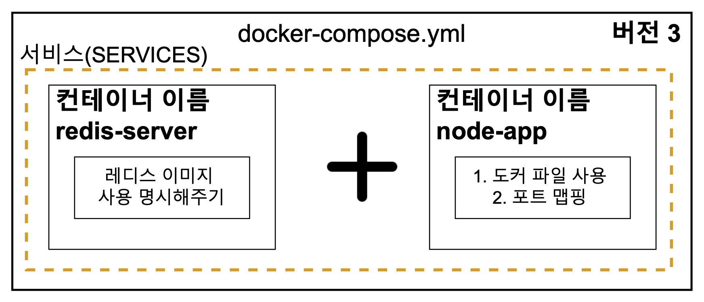

# Docker Compose

> 2개의 컨테이너를 사용하는 실습을 진행하며, 컨테이너 구조는 다음과 같다.   
> 컨테이너1 : Node.js 앱 + Redis 클라이언트  
> 컨테이너2 : Redis 서버

### ❌ 에러: Redis 서버와 연결이 안된다.

Redis 서버를 먼저 실행시키고, Node.js 와 Redis 클라이언트를 실행 시켰는데 에러가 발생했다.
**왜냐하면 컨테이너 간 통신 설정을 별도로 진행하지 않은 상태이기 때문이다.**

### ✅ 해결: Docker Compose를 사용한다.

멀티 컨테이너 상황에서 쉽게 네트워크를 연결시키기 위하여 Docker Compose를 사용하며, 이를 위해
`docker-compose.yml` 파일을 작성한다.

<center></center>

```yaml
version: "3"
services:
  redis-server:
    image: "redis"
  node-app:
    build: .
    ports:
      - "8080:8080"
```

- version : Docker Compose의 버전
- services : 실행하려는 컨테이너들 정의
  - redis-server : 컨테이너 이름
    - image : 컨테이너에서 사용하는 이미지
  - node-app : 컨테이너 이름
    - build : 사용할 도커파일이 있는 디렉토리
    - ports : 포트 맵핑 <로컬 포트 : 컨테이너 포트>

### Docker Compose 실행과 종료

실행을 시키기 위해서는 `docker-compose up` 명령어를 사용한다.

종료를 하기 위해서는 docker-compose.yml 파일이 있는 디렉토리로 이동 후, `docker-compose down`
명령어를 사용하면 종료된다.

만약 `docker-compose up` 명령어를 사용했다면, 추후에 종료하기 위해서 별도의 커맨드를 켜서 `docker-compose down` 을 입력해야 한다.

이러한 번거로움을 막기 위해서 `docker-compose -d up` 명령어를 사용하며, 살펴보면 다음과 같다.

- -d
  - detached 모드로 앱을 백그라운드에서 실행시킨다.
  - 앱에서 나오는 output을 표출하지 않는다.

참고로 `--build` 옵션을 사용하면, 처음부터 다시 빌드한다. `docker-compose up --build`

- docker-compose up : 이미지가 없을 때 이미지를 빌드하고 컨테이너 실행
- docker-compose up --build : 이미지가 있든 없든 이미지를 빌드하고 컨테이너 실행
  - 소스에 수정 사항이 생기면 다시 빌드를 해야하기 때문에 --build 옵션을 사용하는게 좋다.
